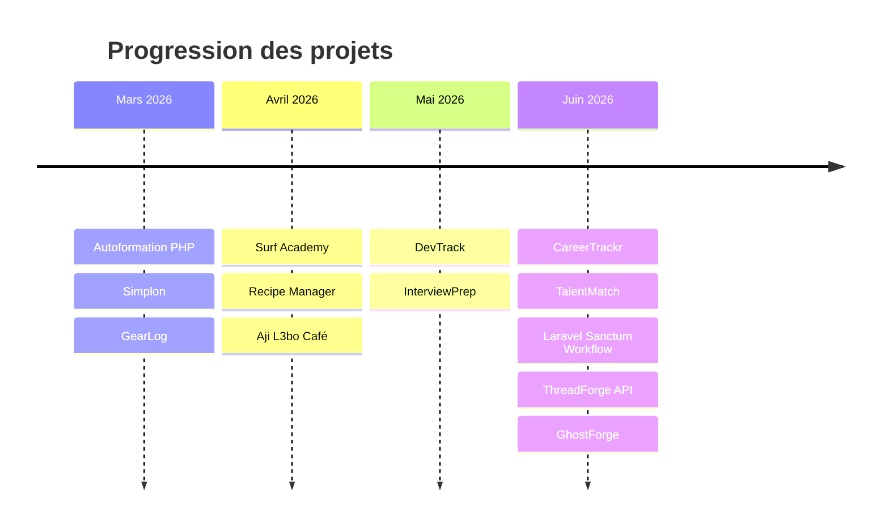
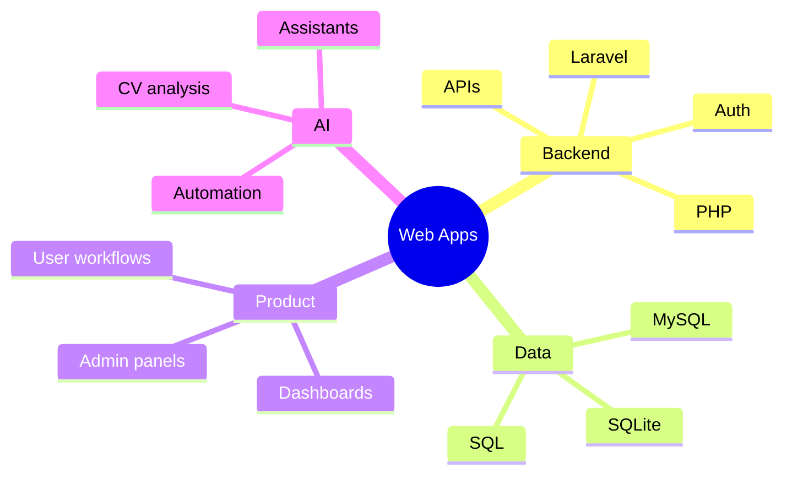

<!--
  Profile README for: https://github.com/wissalaitihya
  Place this file in the root of the repository: wissalaitihya/wissalaitihya
-->

<p align="center">
  
</p>

<p align="center">
  
</p>

<p align="center">
  <a href="https://github.com/wissalaitihya">
    
  </a>
  
  
  
</p>

---

## ✨ À propos de moi

Développeuse web orientée **backend**, je construis des applications utiles, lisibles et bien structurées avec une forte base en **PHP / Laravel**.

J’aime transformer une idée en produit concret : une application métier, un dashboard, une API sécurisée, un workflow clair ou un prototype enrichi par l’IA.

```php
<?php

class WissalAitIhya
{
    public string $role = 'Développeuse Web';
    public array $stack = ['PHP', 'Laravel', 'Blade', 'MySQL', 'SQLite'];
    public array $interests = ['Applications métier', 'APIs', 'Dashboards', 'IA appliquée'];

    public function build(): string
    {
        return 'Des produits utiles, propres et pensés pour de vrais utilisateurs.';
    }
}
```

- 🔭 En ce moment : **Laravel**, APIs sécurisées, architecture métier et IA appliquée
- 🌱 J’explore : assistants conversationnels, workflows automatisés et files de traitement
- 💡 J’aime construire : des produits concrets qui résolvent un vrai besoin utilisateur
- 🧭 Mon style : créatif dans la forme, rigoureux dans la structure

---

## 🧰 Stack principale

<p align="center">
  
</p>

<p align="center">
  
  
  
  
  
  
</p>

---

## 📊 GitHub en mouvement

<p align="center">
  
  
</p>

<p align="center">
  
</p>

<p align="center">
  
</p>

---

## 🚀 Projets phares

<table>
  <tr>
    <td width="50%">
      <h3>🤖 TalentMatch AI</h3>
      <p>
        Assistant de recrutement intelligent pour analyser des CV, comparer des candidats
        et aider la décision RH avec une couche IA.
      </p>
      <p>
        <strong>Tech :</strong> Laravel 13, PHP 8.3, Blade, Tailwind, Alpine.js, SQLite, Pest
      </p>
      <a href="https://github.com/wissalaitihya/TalentMatch">
        
      </a>
    </td>
    <td width="50%">
      <h3>📌 DevTrack</h3>
      <p>
        Outil de gestion de projets et de tâches pour équipes de développement,
        avec rôles, API REST et dashboard métier.
      </p>
      <p>
        <strong>Tech :</strong> Laravel 13, PHP 8.3, MySQL, Breeze, Bootstrap
      </p>
      <a href="https://github.com/wissalaitihya/DevTrack">
        
      </a>
    </td>
  </tr>
  <tr>
    <td width="50%">
      <h3>🎲 Aji L3bo Café</h3>
      <p>
        Application web pour gérer un café de jeux de société : catalogue,
        réservations, sessions live et dashboard admin.
      </p>
      <p>
        <strong>Tech :</strong> PHP 8.2, MySQL, PDO, Apache, CSS custom
      </p>
      <a href="https://github.com/wissalaitihya/Cafe-Aji-L3bo">
        
      </a>
    </td>
    <td width="50%">
      <h3>🍲 Matbakhi / Recipe Manager</h3>
      <p>
        Projet MVC en PHP from scratch pour approfondir l’architecture, l’OOP,
        la modélisation relationnelle et les bonnes pratiques SQL.
      </p>
      <p>
        <strong>Tech :</strong> PHP, MVC, PDO, SQL, CSS
      </p>
      <a href="https://github.com/wissalaitihya/Recipe_Manager-">
        
      </a>
    </td>
  </tr>
</table>

---

## 🔐 Côté API & apprentissage

<p align="center">
  <a href="https://github.com/wissalaitihya/laravel-sanctum-workflow-">
    
  </a>
  <a href="https://github.com/wissalaitihya/ThreadForge-API-">
    
  </a>
</p>

---

## 🗺️ Progression récente



---

## 🧪 Ce que je développe en priorité



---

## ⚡ Activité récente

<!--START_SECTION:latest_repos-->
- **GhostForge** — dépôt Laravel récent, mis à jour le **2026-06-29**
- **ThreadForge-API-** — API Laravel / PHP, mis à jour le **2026-06-26**
- **laravel-sanctum-workflow-** — documentation auth API, mis à jour le **2026-06-25**
- **TalentMatch** — assistant RH enrichi par IA, mis à jour le **2026-06-22**
- **BootHanout** — dépôt Laravel récent, mis à jour le **2026-06-12**
<!--END_SECTION:latest_repos-->

> Cette section peut être automatisée avec GitHub Actions si tu veux qu’elle se mette à jour toute seule.

---

## 🤝 Contact

<p align="center">
  <a href="https://github.com/wissalaitihya">
    
  </a>
</p>

<!--
Décommente et remplace ces liens quand tu veux afficher tes vrais contacts.

<p align="center">
  <a href="mailto:ton-email@example.com">
    
  </a>
  <a href="https://www.linkedin.com/in/ton-profil/">
    
  </a>
  <a href="https://ton-portfolio.com">
    
  </a>
</p>
-->

---

## 🐍 Bonus dynamique optionnel

<!--
Pour afficher un snake de contributions, ajoute d’abord un workflow GitHub Actions qui génère le fichier SVG,
puis décommente ce bloc.

<p align="center">
  
</p>
-->

<p align="center">
  
</p>

<p align="center">
  Merci pour la visite ✨
</p>
